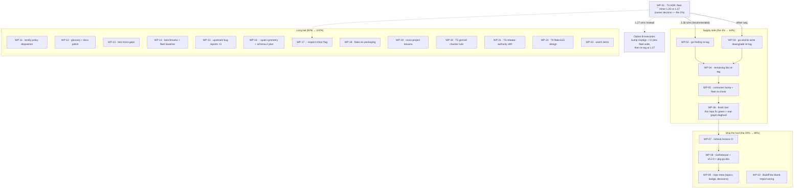

# Execution Plan — Supply-Side Unblock, Publish v0.2.0, and the Long Tail

**Created:** 2026-09-22 20:31 CEST · **Repo:** go-version-auto-configure · **Baseline:** `6a3f6a1` (T11 complete, T12 triaged, gate green — see `docs/status/2026-09-22_20-25_t11-complete-t12-triaged-full-status.md`)

**Purpose:** one plan that covers **every** open TODO (TODO_LIST.md T1–T12 residue + the 50 items from the 2026-09-22 status report section f), Pareto-ranked, split twice: work packages (30–100 min) and micro-tasks (≤12 min), with an execution graph and non-negotiable guardrails.

---

## 1. Pareto Breakdown

### The 1% that delivers 51% — ONE decision

**WP-01: Decide the fleet minor (T4) and write the ADR.**
Everything else is blocked on this single owner decision. 62 modules sit on accidental 1.27/1.27.1 (floor-copied from go-atomic-write), the installed toolchain is go1.26.7 with `GOTOOLCHAIN=local`, and 241 flakes pin go_1_26. Until 1.26-vs-1.27 is decided:

- T1 re-tag targets are undefined (does go-finding re-tag to 1.26 or 1.27?)
- this repo's own `check` can never go green (dep-poisoned steady state)
- `who-forces` cannot analyze go-finding or go-atomic-write at all in this environment
- `--expect-minor` (the enforcement flag) has nothing to enforce

### The 4% that delivers 64% — the decision + the two known poisoners

**WP-01 + WP-02 + WP-03:** the ADR plus re-tagging **go-finding** and **go-atomic-write** — the two identified floor poisoners — with major.minor-only directives (go-atomic-write's 1.27.1 floor is accidental: xxhash 1.11 and flock 1.25.0 allow 1.26). This clears the majority of the 62 accidental modules and un-poisons the autoconfigure family's dependency graph.

### The 20% that delivers 80% — + the rest of the supply side + shipping the tool

**WP-01…WP-06** (full T1: remaining libs, consumer bump, fleet re-check, this repo's finish line) plus **WP-07…WP-10** (CI workflow, GoReleaser + v0.2.0 cut, repo meta, BuildFlow blank-import wiring). Rationale: the tool itself is functionally complete (T11 done, coverage 84–95%, gate green) — its remaining customer value is (a) a fleet that actually converges and (b) being installable/verified instead of build-from-source.

### The remaining 80% → 100% (do not forget the long tail)

**WP-11…WP-23:** policy dispositions (testify), docs/glossary polish, test-coverage micro-gaps, benchmarks with real numbers, three evidenced upstream bug reports, CLI symmetry + schema-2 planning, `--expect-minor` enforcement, flake.nix packaging, cross-project lessons, and the three WORTH-CONSIDERING designs (T5, T6, T9). None block the 80%; all are queued with effort so they stop being ambient guilt.

---

## 2. Comprehensive Plan — Work Packages (30–100 min each)

Sorted by importance/impact/effort/customer-value. "Covers" lists every source TODO subsumed (T-numbers = TODO_LIST.md; F-numbers = status report 2026-09-22 section f items).

| WP | Work package | Covers | Impact | Effort | Customer value |
|----|--------------|--------|--------|--------|----------------|
| WP-01 | **Fleet minor ADR (owner session):** inventory the 62 modules, present Option A (downgrade to 1.26, recommended) vs Option B (adopt 1.27, bump nixpkgs + CI), record decision + rationale as ADR | T4 (all), F27 | Critical | 60 min | Unblocks the entire campaign; fleet policy becomes citable |
| WP-02 | **go-finding re-tag:** baseline → strip patch components (1.26 or 1.27 per WP-01) → verify builds → tag → replace-directive hygiene → proxy `go get` verification | T1 items 1, 6, 7; F2 | Critical | 90 min | Biggest single poisoner removed |
| WP-03 | **go-atomic-write re-tag:** accidental `go 1.27.1` → `go 1.26` downgrade (F16 owner confirmation), verify deps (xxhash 1.11, flock 1.25.0), tag, proxy check | T1 item 2, 6, 7; F3 | Critical | 60 min | Source of the accidental 1.27 wave eliminated |
| WP-04 | **Remaining libs re-tag sweep:** go-error-family + every other published go-* lib with patch-form floors (same protocol as WP-02) | T1 item 3; F4 | Critical | 90 min | Supply side fully clean |
| WP-05 | **Consumer bump + fleet re-check:** bump autoconfigure family + fleet consumers to clean versions (go-ecosystem-upgrade protocol), then `check --quiet --json` fleet-wide expecting ~0 mechanical findings surviving tidy | T1 items 4, 5; F6 | Critical | 100 min | Fleet actually converges |
| WP-06 | **Finish line:** this repo `fix .` expecting `applied 1, dep-forced 0`, `check` exit 0; dogfood `who-forces` on a real resolvable poisoned graph | T1; F35, F36, F48 | Critical | 30 min | The tool's own repo becomes the showcase |
| WP-07 | **GitHub Actions CI:** lint + test + race matrix + dogfood `check .` gate + erraudit gate (`--type-aware`, fallback `--type legacy_as`), `GOEXPERIMENT=jsonv2` in env | T3 item 1; F28 | High | 90 min | Every push verified; drift regression-proofed |
| WP-08 | **Release v0.2.0:** GoReleaser config with ldflags version stamping, pkg.go.dev verification, cut v0.2.0 from CHANGELOG Unreleased | T3 items 2, 3, 10; F11, F12 | High | 90 min | Tool becomes installable, not build-from-source |
| WP-09 | **Repo meta:** topics, CI badge, module-path casing `go get` check, README build-from-source clean-env verify, branch-protection decision (daemon vs required checks), website-launch decision | T3 items 4–9; F13–F18 | Medium | 60 min | Public presence and repo hygiene |
| WP-10 | **BuildFlow wiring:** blank-import the provider in BuildFlow's SDK import set, add provider-catalog docs, confirm `buildflow --dry-run` discovery, decide DAG position (after go-mod-update, before nix-checker) | T2 (all); F19–F21 | High | 45 min | Tool runs automatically in every BuildFlow repo — zero-touch adoption |
| WP-11 | **Testify policy:** owner decides keep vs stdlib-migrate; implement disposition for the 366 go-auto-upgrade findings (policy annotation + suppress, or migration campaign kickoff) | T12; F22 | High | 30 min (decide) | 366 findings stop being noise |
| WP-12 | **Docs polish:** DOMAIN_LANGUAGE.md vocabulary (poisonerFloors, ModuleVersion, toolchain-non-version, go-work-unparseable, schema), README scripting recipe, poisonerFloors wording check, ROADMAP POSIX entry, error-branch coverage acceptance note | F29, F38, F39, F43, F46 | Medium | 45 min | New vocabulary is written down where the next session looks |
| WP-13 | **Test micro-gaps:** who-forces JSON decode asserts (`schema`, `kind: "go.work"` through JSON), provider test for go-work-unparseable fixture, `--parallel 0` parity test, resolvePoisoners ordering consistency | F33, F34, F42, F47 | Medium | 60 min | Contract asserted at the wire level, not just in Go structs |
| WP-14 | **Benchmarks + fleet baseline:** `-benchmem`, parallel 1/4/auto comparison table, record in docs; `check --quiet --parallel auto ~/projects/*` full-fleet sweep as the session-independent baseline | F37, F45 | Medium | 60 min | "Scales with drifted repos" claim gets numbers |
| WP-15 | **Upstream bug reports** (verify-before-filing → github-voice): BuildFlow single-step skip_steps WARN cosmetic; cqrs-lint A018 fires with zero imports; branching-flow INDEX_OUT_OF_RANGE false positive on range-bounded worker pool | F30, F31, F32; T12 | Medium | 90 min | Fixes benefit every fleet repo, not just this one |
| WP-16 | **CLI symmetry + contract plan:** `fix --quiet` / `who-forces --quiet`; schema-2 decision doc (drop `poisoners` vs keep additive-forever) | F40, F41 | Medium | 45 min | Scripting surface consistent; wire-contract future is explicit |
| WP-17 | **`--expect-minor` flag:** enforce the ADR's minor as an alignment finding when pins/directives exceed it; tests + README | T4 encode; F27 | High | 60 min | Decision becomes machine-enforced (depends on WP-01) |
| WP-18 | **flake.nix for this repo:** decide and implement fleet-standard packaging with version stamping (mkPreparedSource, ldflags shortRev) | F44 | Medium | 100 min | `nix build` distribution path; devShell standardization |
| WP-19 | **Cross-project lessons:** "probe the real toolchain before encoding go-tool behavior" and "capture exit codes before pipes" into crush-config `references/lessons.md` | F49, F50 | Low | 30 min | Two session failures never repeat in any repo |
| WP-20 | **T5 design:** gomod-checker upstream rule "go directive carries patch component after tidy" (the poisoning signature) | T5 | Low | 100 min | Closes the loop for repos that never run this tool |
| WP-21 | **T6 design:** release-authority drift detection (VERSION file vs CHANGELOG top vs newest git tag) in pkg/surface or project-dependency-graph | T6 | Low | 100 min | New drift class covered |
| WP-22 | **T9 design:** opt-in impure command for flake.lock effective Go revision (keeps `Discover` pure) | T9 | Low | 60 min | Blocked-by-design item gets a real design |
| WP-23 | **Watch items:** forbidigo-vanishing recurrence check; dependabot-auto-configure upstream status | T12 | Low | 30 min | Ambient findings stay dispositioned, not forgotten |

**Sum:** 23 packages ≈ 1,840 min ≈ 31 h of focused work. All 50 status-report items and all open TODO_LIST items are covered (coverage proof in §4).

---

## 3. Detailed Breakdown — Micro-Tasks (each ≤12 min)

Same sort order as §2. Effort is uniformly S (<12 min) by construction; impact inherited from the work package.

### WP-01 Fleet minor ADR

| ID | Task | Impact |
|----|------|--------|
| 1.1 | Gather evidence: count modules declaring 1.27/1.27.1 (`grep -r "^go 1.27" --include=go.mod ~/projects \| wc -l`), flake pin counts | Critical |
| 1.2 | Draft ADR skeleton: context (floor-poisoning root cause), options A/B | Critical |
| 1.3 | Option A spec: downgrade floors fleet-wide, supply-side first, nixpkgs 1.26 stays | Critical |
| 1.4 | Option B spec: adopt 1.27, bump nixpkgs + 42 flake pins + CI pins fleet-wide | Critical |
| 1.5 | List consequences of each option on this tool (`--expect-minor`, alignment findings) | Critical |
| 1.6 | **Ask Lars to decide** (this is status-report question ①) | Critical |
| 1.7 | Record decision + rationale as `docs/adr/0001-fleet-go-minor.md`; link from TODO_LIST T4 | Critical |

### WP-02 go-finding re-tag

| ID | Task | Impact |
|----|------|--------|
| 2.1 | Baseline: `git status` clean, record current tags + go directives of all 4 go-finding modules | Critical |
| 2.2 | Strip patch components from go directives per WP-01 decision (go mod edit -go=…) | Critical |
| 2.3 | Build + test go-finding locally; verify toolsdk module unaffected | Critical |
| 2.4 | Check for `replace` directives leaking into any go.mod (go-release Phase 3) | High |
| 2.5 | Tag + push; run `go get github.com/larsartmann/go-finding@latest` proxy verification | Critical |
| 2.6 | Verify pkg.go.dev reflects the new version | High |

### WP-03 go-atomic-write re-tag

| ID | Task | Impact |
|----|------|--------|
| 3.1 | Confirm the 1.27.1→1.26 downgrade with Lars (F16: never auto-downgrade without owner) | Critical |
| 3.2 | Baseline + strip directive to `go 1.26` via go mod edit | Critical |
| 3.3 | Verify deps allow 1.26: xxhash 1.11, flock 1.25.0 floors | Critical |
| 3.4 | Build + test; replace-directive check | Critical |
| 3.5 | Tag + push + proxy `go get` verification | Critical |

### WP-04 Remaining libs re-tag sweep

| ID | Task | Impact |
|----|------|--------|
| 4.1 | Enumerate published go-* libs with patch-form floors: `/tmp/gvac check --json ~/projects/go-* \| jq …` | Critical |
| 4.2 | go-error-family: baseline + strip + test | Critical |
| 4.3 | go-error-family: tag + push + proxy verify | Critical |
| 4.4 | Repeat strip/tag for each additional lib found in 4.1 | Critical |
| 4.5 | Update fleet inventory doc with before/after floor table | High |

### WP-05 Consumer bump + fleet re-check

| ID | Task | Impact |
|----|------|--------|
| 5.1 | Bump linter-autoconfigure-sdk to clean go-finding version; tidy; test | Critical |
| 5.2 | Bump this repo to clean versions; tidy; test | Critical |
| 5.3 | Sweep remaining fleet consumers in dependency order (go-ecosystem-upgrade: baseline→sweep→test→commit per repo) | Critical |
| 5.4 | Re-tag any consumer lib that needed directive changes | High |
| 5.5 | Fleet re-check: `/tmp/gvac check --quiet --json ~/projects/*/` — count mechanical findings | Critical |
| 5.6 | Record before/after finding counts in the ADR appendix | High |

### WP-06 Finish line

| ID | Task | Impact |
|----|------|--------|
| 6.1 | `fix .` → expect `applied 1, dep-forced 0`; `check .` → exit 0 | Critical |
| 6.2 | `who-forces` on a real resolvable poisoned graph — validate poisonerFloors against reality | Critical |
| 6.3 | Dogfood `fix` end-to-end on a disposable copy of a foreign drifted repo (full dep-forced naming path) | High |
| 6.4 | Update AGENTS.md dogfooding caveat (poison no longer present) | Medium |

### WP-07 GitHub Actions CI

| ID | Task | Impact |
|----|------|--------|
| 7.1 | Draft workflow: checkout, nix devShell or GOEXPERIMENT=jsonv2 env, `go test -race ./...` | High |
| 7.2 | Add golangci-lint step (buildflow-compatible config) | High |
| 7.3 | Add dogfood gate: `go run ./cmd/go-version-auto-configure check .` (expect exit 0 post-WP-06) | High |
| 7.4 | Add erraudit gate: `--type-aware`, document `--type legacy_as` fallback | Medium |
| 7.5 | Verify workflow green on a branch; then merge | High |

### WP-08 Release v0.2.0

| ID | Task | Impact |
|----|------|--------|
| 8.1 | GoReleaser config: build cmd/, ldflags `-X pkg/version.injected={{.ShortCommit}}` | High |
| 8.2 | Test release locally (`goreleaser check` + `--snapshot`) | High |
| 8.3 | Verify README build-from-source steps in clean env (container/nix shell) | Medium |
| 8.4 | Module-path casing check: real `go get github.com/larsartmann/go-version-auto-configure@v0.2.0` | Medium |
| 8.5 | Move CHANGELOG Unreleased → `## [0.2.0] - <date>`; pkg.go.dev verification | High |
| 8.6 | Tag v0.2.0, push, confirm GitHub Release + proxy | High |

### WP-09 Repo meta

| ID | Task | Impact |
|----|------|--------|
| 9.1 | Set repo topics: go, buildflow, golangci, auto-configure, version-surface | Medium |
| 9.2 | Add CI badge to README (after WP-07) | Low |
| 9.3 | Decide + document branch protection vs auto-commit daemon (owner) | High |
| 9.4 | Website-launch decision (sibling-project pattern) — likely defer | Low |

### WP-10 BuildFlow wiring

| ID | Task | Impact |
|----|------|--------|
| 10.1 | Add `_ "github.com/larsartmann/go-version-auto-configure/pkg/provider"` to BuildFlow SDK imports | High |
| 10.2 | Add provider-catalog docs entry (mirror oxlint's) | Medium |
| 10.3 | `buildflow --dry-run` confirms discovery | High |
| 10.4 | Decide DAG position: after go-mod-update, before nix-checker; record | Medium |

### WP-11 Testify policy

| ID | Task | Impact |
|----|------|--------|
| 11.1 | **Ask Lars:** keep testify or migrate to stdlib (status-report question ②) | High |
| 11.2 | Keep → write fleet policy note + suppress go-auto-upgrade testify rule with rationale | High |
| 11.3 | Migrate → start with this repo (87 call sites, mechanical), then fleet campaign | High |

### WP-12 Docs polish

| ID | Task | Impact |
|----|------|--------|
| 12.1 | DOMAIN_LANGUAGE.md: poisonerFloors, ModuleVersion, toolchain-non-version, go-work-unparseable, schema | High |
| 12.2 | README: canonical fleet cron line `check --quiet --parallel N --json ~/projects/*/ ; echo $?` | Medium |
| 12.3 | README: verify poisonerFloors field wording in machine-contract table | Low |
| 12.4 | ROADMAP: POSIX/filepath assumptions entry | Low |
| 12.5 | Test docs: error-branch functions below 80% are accepted (one sentence) | Low |

### WP-13 Test micro-gaps

| ID | Task | Impact |
|----|------|--------|
| 13.1 | who-forces JSON test: assert `schema` decodes | Medium |
| 13.2 | who-forces JSON test: assert `kind: "go.work"` row decodes through the wire | Medium |
| 13.3 | Provider test: go-work-unparseable fixture through `Provider.Detect` | Medium |
| 13.4 | `check --parallel 0` (explicit auto) parity with default | Low |
| 13.5 | Verify resolvePoisoners output ordering vs who-forces sorted presentation | Low |

### WP-14 Benchmarks + fleet baseline

| ID | Task | Impact |
|----|------|--------|
| 14.1 | Add `-benchmem` invocation + record allocations | Medium |
| 14.2 | Run parallel 1 / 4 / auto comparison on 8 and 32 seeded repos; record table | Medium |
| 14.3 | Full-fleet baseline sweep `check --quiet --parallel auto ~/projects/*/`; record timing + counts | Medium |

### WP-15 Upstream bug reports

| ID | Task | Impact |
|----|------|--------|
| 15.1 | Repro + file: BuildFlow single-step skip_steps WARN cosmetic (evidence in AGENTS.md) | Medium |
| 15.2 | Repro + file: cqrs-lint A018 "imports go-cqrs-lite" with zero imports | Medium |
| 15.3 | Repro + file: branching-flow INDEX_OUT_OF_RANGE on range-bounded worker pool | Medium |

### WP-16 CLI symmetry + schema plan

| ID | Task | Impact |
|----|------|--------|
| 16.1 | Implement `fix --quiet` + `who-forces --quiet` + tests | Medium |
| 16.2 | Write schema-2 decision doc: drop `poisoners []string` vs additive-forever (needs Lars input) | Medium |

### WP-17 --expect-minor flag (post-ADR)

| ID | Task | Impact |
|----|------|--------|
| 17.1 | Design: flag semantics — minor above expectation fires alignment finding | High |
| 17.2 | Implement in pkg/surface + CLI + tests | High |
| 17.3 | README + usage text | Medium |

### WP-18 flake.nix for this repo

| ID | Task | Impact |
|----|------|--------|
| 18.1 | Decide: flake.nix now or continue BuildFlow-only (owner) | Medium |
| 18.2 | Implement: mkPreparedSource + buildGoModule + ldflags shortRev stamping | Medium |
| 18.3 | `nix build` + verify `./result/bin/go-version-auto-configure version` matches nix stamp format | Medium |

### WP-19 Cross-project lessons

| ID | Task | Impact |
|----|------|--------|
| 19.1 | lessons.md: "probe the real toolchain before encoding go-tool behavior" (toolchain-local incident) | Medium |
| 19.2 | lessons.md: "capture exit codes before pipes" (twice bitten) | Low |

### WP-20–23 Long tail (design + watch)

| ID | Task | Impact |
|----|------|--------|
| 20.1 | T5: draft gomod-checker rule spec (patch-form-after-tidy signature) | Low |
| 20.2 | T5: file upstream proposal with fixture | Low |
| 21.1 | T6: draft release-authority drift design (VERSION vs CHANGELOG vs tag) | Low |
| 22.1 | T9: draft opt-in impure flake.lock command design (Discover stays pure) | Low |
| 23.1 | Re-check forbidigo vanishing recurrence; file if reproducible | Low |
| 23.2 | Check dependabot-auto-configure upstream issue status | Low |

---

## 4. Coverage Proof — every open TODO lands in this plan

| Source item | Lands in |
|-------------|----------|
| T1 items 1–7 | WP-02, WP-03, WP-04, WP-05 |
| T1 finish line (AGENTS.md steady state) | WP-06 |
| T2 items 1–3 | WP-10 |
| T3 items 1–10 | WP-07, WP-08, WP-09 |
| T4 items 1–5 | WP-01, WP-17 |
| T5 | WP-20 |
| T6 | WP-21 |
| T9 | WP-22 |
| T11 | ✅ done 2026-09-22 (no work) |
| T12: testify (366) | WP-11 |
| T12: forbidigo vanishing | WP-23 |
| T12: INDEX_OUT_OF_RANGE warnings | WP-15 (upstream report), AGENTS.md note (done) |
| T12: dependabot FP | WP-23 |
| Status (f) 29 DOMAIN_LANGUAGE | WP-12 |
| Status (f) 30–32 upstream reports | WP-15 |
| Status (f) 33–34 test asserts | WP-13 |
| Status (f) 35–36 dogfood | WP-06 |
| Status (f) 37 benchmarks | WP-14 |
| Status (f) 38 coverage acceptance | WP-12 |
| Status (f) 39, 43, 46 README/ROADMAP | WP-12 |
| Status (f) 40 schema-2 | WP-16 |
| Status (f) 41 --quiet symmetry | WP-16 |
| Status (f) 42 resolvePoisoners ordering | WP-13 |
| Status (f) 44 flake.nix | WP-18 |
| Status (f) 45 fleet-scale sweep | WP-14 |
| Status (f) 47 parallel-0 parity | WP-13 |
| Status (f) 48 finish-line fix | WP-06 |
| Status (f) 49–50 lessons | WP-19 |

**Nothing open is unassigned.** T11 and the six done T12 items are complete with evidence (status report §a).

---

## 5. Execution Graph

**Critical path:** WP-01 → WP-02/03 → WP-04 → WP-05 → WP-06 → WP-07 → WP-08. Everything in the long tail is parallelizable at any point after WP-01.

---

## 6. Guardrails (the VerschlimmBesserer clause)

1. **ADR before fleet action.** No directive is stripped anywhere until WP-01's decision is recorded. Re-tagging to the wrong minor is a fleet-wide revert.
2. **F16: never auto-downgrade without owner confirmation** — go-atomic-write's 1.27.1→1.26 downgrade is WP-03 task 3.1, an explicit ask.
3. **go-release Phase 3 hygiene on every re-tag:** no `replace` directives, build + test before tag, proxy verification after tag. A poisoned tag poisons the module proxy for everyone.
4. **Additive-only wire changes until the schema-2 decision (WP-16)** — `poisoners` stays; new fields are additive; `schema` bumps only on breaking changes.
5. **No mass mechanical migration without a decision** — testify (366 findings) and the fleet minor are owner calls; doing them "because a linter said so" is exactly the cargo-cult the skills warn about.
6. **Upstream reports go through verify-before-filing + github-voice** — every one of the three WP-15 reports has local evidence already, but the repro must be re-verified against the upstream project's current head, in Lars's voice, before filing.
7. **Per-package verify loop stays:** build → test → race → `buildflow -s golangci-lint` → erraudit after every code-touching package. The gate at `--fail-on=error` must not regress.
8. **Docs are part of done:** every new rule/flag/field gets CHANGELOG + FEATURES + (where applicable) DOMAIN_LANGUAGE updates in the same work package — the 2026-09-22 session's one real documentation miss.

---

## 7. What I need from Lars (blocking, cannot self-answer)

1. **Fleet minor:** 1.26 (downgrade, recommended) or 1.27 (adopt)? → WP-01, blocks the critical path.
2. **Testify:** keep or migrate to stdlib? → WP-11, dispositions 366 findings.
3. **Schema-2 appetite:** when who-forces v2 lands, drop `poisoners []string` (breaking, clean) or keep additive-forever? → WP-16.

---

*Plan artifact, not a status snapshot: TODO_LIST.md remains the living source; this file is the execution order. After execution starts, update progress in TODO_LIST (docs-health) and re-plan only if the WP-01 decision invalidates the critical path.*
