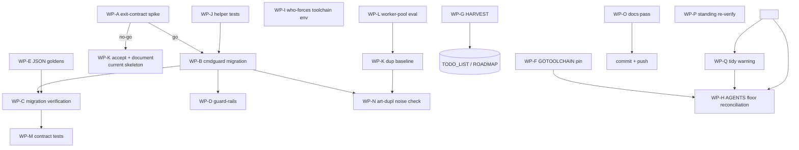

# Execution Plan — cmdguard CLI Surface, Verification Hardening, and the Local Long Tail

- **Created:** 2026-09-22 22:07 CEST
- **Repo:** `github.com/larsartmann/go-version-auto-configure` (master)
- **Input:** deduplication session of 2026-09-22 (report: `docs/status/2026-09-22_21-28_deduplication-session-status.md`) + the cmdguard discovery that invalidated the "accepted clone" rationale.
- **Sibling plan (do not duplicate):** `docs/planning/2026-09-22_20-31_supply-side-unblock-and-ship-plan.md` owns the supply-side campaign (fleet minor ADR, go-finding/go-atomic-write re-tags, v0.2.0 ship). This plan owns the **CLI surface and verification** work local to this repo and defers all supply-side items to the sibling.
- **Verified state at planning time:** `go build ./...` + `go test ./...` **fully green** on all 5 packages (`GOTOOLCHAIN=go1.27.1 GOEXPERIMENT=jsonv2`); the concurrent session's pkg/fix canonicalize work has landed; working tree clean.
- **Format note:** user requested Markdown + mermaid graph; the pareto-planning skill's canonical format is styled HTML — override honored, not propagated as default.

---

## 0. What changed the picture (context)

1. **cmdguard v4 exists** (`/home/lars/projects/cmdguard`, fleet CLI framework): struct-tag flags validated at construction, typed handlers, exit-code ownership (`ExitCoder` / `v4.ExitCode`), print-once errors, DI scope. This makes the hand-rolled `flag`-package skeleton in `cmd/go-version-auto-configure/main.go` — and the "accepted clone group" from the dedup session — a symptom of not using the fleet stack.
2. **The dedup session's outcome is superseded:** `newRunFlagSet`/`parseRoots` were the right local move but the right global move is deleting them via cmdguard. The migration must not regress: exit contract (0 clean / 1 findings / 2 errors), stable `--json` wire contract, human report formats, `usage` text, multi-root parallel behavior.
3. **One genuine technical risk:** cmdguard prints returned errors exactly once and maps exit codes via `ExitCoder`. `check` exits **1 on findings without printing an error**. The spike must prove a silent exit-1 path before any migration.
4. Verschlimmbessern guards: the `--json` schema is a "stable machine contract" (AGENTS); human output shape is consumed by fleet sweeps and BuildFlow. Any output change = broken consumers. Every WP below ends in a verification step; nothing merges with red tests.

---

## 1. Pareto Breakdown

**The result we optimize:** a CLI surface that is fleet-consistent (cmdguard), contract-stable (`--json` + exit codes verified by tests), and maintainable (no hand-rolled flag plumbing anywhere in the auto-configurer family).

### The 1% that delivers 51%

**WP-A — cmdguard exit-contract spike (go/no-go).** One hour that answers the only blocking unknown: can `check` return exit 1 on findings *silently* through cmdguard's ExitCoder/ExitCode path, and does the human report stay print-once? Everything downstream (the whole migration) hangs on this. If the spike fails, the fallback plan is: keep the current skeleton, document cmdguard's gap upstream, and the accepted-clone rationale stands.

### The 4% that deliver 64%

1% + **migration itself + its guard-rails**:
- **WP-B** migrate the four subcommands to cmdguard v4 (shared flags via embedded flag struct — deletes `newRunFlagSet`, `parseRoots`, `runFlags`, and the accepted clone group *class*)
- **WP-C** full migration verification (exit codes, help, JSON diff vs pre-migration snapshots, multi-root parallel)
- **WP-D** the golden test that makes this class of drift impossible again: identical-flag-contract assertion + a guard against reintroducing the raw `flag` package in `cmd/`

### The 20% that deliver 80%

4% + contract and environment hardening:
- **WP-E** JSON wire-contract golden tests (`emitCheckJSON`/`emitFixJSON`/`emitFloorsJSON`) — the "stable machine contract" currently has no snapshot
- **WP-F** GOTOOLCHAIN pin into `flake.nix` devShell; de-prefix AGENTS.md commands (fixes the doc-debt the dedup session created)
- **WP-G** HARVEST: pull this plan + the status report into `TODO_LIST.md`/`ROADMAP.md` (docs-health)
- **WP-H** reconcile AGENTS.md floor-policy text with the sibling plan's fleet-minor ADR outcome
- **WP-I** who-forces child-process env: pass/normalize toolchain so `go list` works on 1.27-floor repos from older shells
- **WP-J** unit tests for retained helpers (`readLines` error path, etc.)
- **WP-K** accepted-duplication baseline doc (so future art-dupl runs diff against a known list)

### The remaining 20% → 100% (do not forget)

- **WP-L** evaluate the worker-pool shape shared by `analyzeAll`/`applyAll`/`cmdWhoForces` (generics helper vs documented accept)
- **WP-M** `-h` exit-code contract + version-stamp CI test
- **WP-N** art-dupl `-t 5 --html` noise check post-migration (expect the clone groups to vanish)
- **WP-O** docs: CHANGELOG entry for dedup+migration, DOMAIN_LANGUAGE vocabulary, fleet lesson into crush-config `references/lessons.md` (by commit there), FLEET-STANDARD cross-reference
- **WP-P** re-verify standing upstream notes (cqrs-lint false positives, dependabot FP, branching-flow warnings)
- **WP-Q** go-atomic-write `go mod tidy` direct-dep warning (gated on sibling plan's ADR decision)

**Explicitly out of scope here** (sibling plan owns): fleet minor ADR, go-finding/go-atomic-write/remaining-lib re-tags, v0.2.0 release, T9 flake.lock parsing.

---

## 2. Comprehensive Plan — Work Packages (30–100 min each)

Sorted by impact/effort/customer-value. "Blocked by" chains are in the graph in §4.

| # | WP | Task | Impact | Effort | Category | Depends on |
|---|----|------|--------|--------|----------|-----------|
| 1 | A | cmdguard exit-contract spike: silent exit-1-findings via ExitCoder, print-once, JSON untouched, multi-root positional args | Critical | 60 min | Decision/Feature | — |
| 2 | B | Migrate cmd/ (check, fix, who-forces, version) to cmdguard v4; shared `--json`/`--parallel` via embedded flags struct; delete `runFlags`/`newRunFlagSet`/`parseRoots` | Critical | 100 min | Refactor/Feature | A go |
| 3 | C | Migration verification: pre/post snapshots of `--help`, human output, `--json` output, exit codes on clean/drifted/error repos, multi-root + `--parallel` | Critical | 60 min | Quality | B |
| 4 | D | Guard-rails: golden test asserting the shared flag contract across subcommands; lint/grep rule banning raw `flag` + `cobra` imports in `cmd/` | High | 30 min | Quality | B |
| 5 | E | JSON wire-contract golden tests (go-snaps) for `emitCheckJSON`, `emitFixJSON`, `emitFloorsJSON` | High | 60 min | Quality | — |
| 6 | F | Move `GOTOOLCHAIN` pin to `flake.nix` devShell; de-prefix AGENTS.md Build & Run commands | High | 30 min | Cleanup | — |
| 7 | G | HARVEST this plan + status report into `TODO_LIST.md` / `ROADMAP.md` | High | 30 min | Documentation | plan approved |
| 8 | H | Reconcile AGENTS.md floor-policy + dogfooding caveat with sibling ADR outcome (go 1.27 stay/leave) | High | 30 min | Documentation | sibling ADR |
| 9 | I | who-forces: explicit toolchain env for exec'd `go list` (respect parent, normalize for floor analysis); policy note in fix pkg runner | High | 90 min | Feature | — |
| 10 | J | Unit tests for retained helpers: `readLines` unreadable path, `rootsFrom` edge cases | Medium | 30 min | Quality | B (survivors list) |
| 11 | K | DEDUPLICATION baseline doc: accepted clone groups + rationale, art-dupl invocation record | Medium | 30 min | Quality | B (post-migration list) |
| 12 | L | Worker-pool shape: evaluate generic `runParallel[T]` vs documented accept across analyzeAll/applyAll/cmdWhoForces | Medium | 60 min | Refactor | — |
| 13 | M | `-h` exit-code contract test + version-stamp (`ldflags`/dirty) CI assertion | Medium | 30 min | Quality | C |
| 14 | N | art-dupl `-t 5 --html` re-run post-migration: confirm zero clone groups in cmd/; record result in K | Medium | 30 min | Quality | B |
| 15 | O | Docs pass: CHANGELOG (dedup + migration), DOMAIN_LANGUAGE (command-surface terms), fleet lesson to crush-config `references/lessons.md`, FLEET-STANDARD cross-ref | Medium | 60 min | Documentation | B |
| 16 | P | Re-verify standing upstream notes (cqrs-lint, dependabot "no update groups", branching-flow INDEX_OUT_OF_RANGE) against current head; update AGENTS notes | Low | 60 min | Cleanup | — |
| 17 | Q | go-atomic-write direct-dep tidy warning resolution | Low | 30 min | Cleanup | sibling ADR |

Total: 17 work packages, ~15.5 h.

---

## 3. Detailed Breakdown — Micro-Tasks (each ≤12 min)

### WP-A — cmdguard exit-contract spike

| # | Micro-task | ≤ min |
|---|-----------|-------|
| A1 | Add `github.com/larsartmann/cmdguard/v4` to a scratch module (not this repo) with a 2-command toy CLI | 12 |
| A2 | Implement "findings" handler returning a sentinel `ExitCoder` with code 1; run; observe stdout/stderr | 12 |
| A3 | Verify: does cmdguard print the sentinel error? If yes, test `errors.Is`-style silent sentinel support or a `NoPrint` option in `errors.go`/`cli.go` | 12 |
| A4 | Verify exit code mapping (`v4.ExitCode`) returns 1 without printing | 12 |
| A5 | Verify positional-args access in handlers (multi-root) + struct-tag flags incl. embedded flags struct recursion (`ParseFlagTags`) | 12 |
| A6 | Write 1-page spike verdict (works / workaround / blocker) into this file as an addendum; go/no-go for WP-B | 12 |

### WP-B — cmdguard migration

| # | Micro-task | ≤ min |
|---|-----------|-------|
| B1 | Define flag structs: `CommonFlags{JSON, Parallel}` + `CheckFlags`, `FixFlags`, `WhoForcesFlags` (embedded common) | 12 |
| B2 | `NewCLI` + register `check` command, port `analyzeAll` wiring, keep handler pure (no output changes) | 12 |
| B3 | Port `fix` command (dry-run flag, `applyAll`, `exitFromOutcomes` via ExitCoder) | 12 |
| B4 | Port `who-forces` command (allow-partial flag, own worker pool) | 12 |
| B5 | Port `version`/`--version` (cmdguard built-in version vs custom — pick one, keep stamp) | 12 |
| B6 | Delete `runFlags`, `newRunFlagSet`, `parseRoots`, `usage` const (fang owns usage); keep `rootsFrom`, `workersFor` | 12 |
| B7 | Wire exit contract: findings→1, discovery/failed→1, hard error→2 via ExitCoder types | 12 |
| B8 | `go build` + fix compile fallout; old tests green or consciously updated | 12 |

### WP-C — Migration verification

| # | Micro-task | ≤ min |
|---|-----------|-------|
| C1 | Snapshot pre-migration outputs (clean repo, drifted repo, JSON) into testdata | 12 |
| C2 | Exit-code matrix test: clean→0, findings→1, hard error→2, fix clean→0 | 12 |
| C3 | `--json` output diff vs snapshots (must be byte-identical) | 12 |
| C4 | Human output review: fang styling vs old plain text; decide keep/suppress; document any change as breaking in CHANGELOG | 12 |
| C5 | Multi-root + `--parallel 1` vs auto: sorted deterministic output preserved | 12 |
| C6 | Full `go test ./...` + race on cmd package | 12 |

### WP-D — Guard-rails

| # | Micro-task | ≤ min |
|---|-----------|-------|
| D1 | Golden test: shared flag contract (names/defaults/help) identical across check/fix/who-forces | 12 |
| D2 | Lint rule (grep-based check or golangci custom) banning `flag.` and cobra imports in `cmd/` | 12 |
| D3 | Wire rule into buildflow config/docs | 12 |

### WP-E — JSON golden tests

| # | Micro-task | ≤ min |
|---|-----------|-------|
| E1 | go-snaps (or golden files) for `emitCheckJSON`: clean, findings, discovery, error repos | 12 |
| E2 | Goldens for `emitFixJSON`: applied, held-back (dep-forced), skipped | 12 |
| E3 | Goldens for `emitFloorsJSON`: rows, go-work row, allow-partial on/off | 12 |
| E4 | Schema-stability assertion (schema: 1 field present, camelCase keys) | 12 |

### WP-F — GOTOOLCHAIN pin

| # | Micro-task | ≤ min |
|---|-----------|-------|
| F1 | Add `GOTOOLCHAIN = "go1.27.1"` to `flake.nix` devShell | 12 |
| F2 | De-prefix AGENTS.md Build & Run commands; keep one-line pointer to devShell | 12 |
| F3 | Verify `nix develop -c go test ./...` (or equivalent) picks the pinned toolchain | 12 |

### WP-G — HARVEST

| # | Micro-task | ≤ min |
|---|-----------|-------|
| G1 | docs-health HARVEST: merge plan WPs + status-report items into `TODO_LIST.md` | 12 |
| G2 | Route supply-side items explicitly to the sibling plan (avoid dual ownership) | 12 |
| G3 | ROADMAP: long-tail ideas (cmdguard adoption across the auto-configurer family) | 12 |

### WP-H — AGENTS floor reconciliation

| # | Micro-task | ≤ min |
|---|-----------|-------|
| H1 | Read sibling ADR outcome; update Environment reality + dogfooding caveat to match | 12 |
| H2 | Remove/adjust any now-false statements (steady-state claims) | 12 |

### WP-I — who-forces toolchain env

| # | Micro-task | ≤ min |
|---|-----------|-------|
| I1 | Reproduce: `who-forces` on 1.27-floor repo from go1.26.7 shell (known failure) | 12 |
| I2 | Decide policy: inherit parent env vs explicit normalization (mirror policy #3's GOWORK dispatch) | 12 |
| I3 | Implement in fix pkg runner (`AnalyzeFloors` path) | 12 |
| I4 | Test both shell scenarios (1.26.7 ambient, go1.27.1 exported) | 12 |
| I5 | AGENTS policy note | 12 |

### WP-J — Retained-helper tests

| # | Micro-task | ≤ min |
|---|-----------|-------|
| J1 | `readLines`: unreadable path → nil, no panic; normal file → lines | 12 |
| J2 | `rootsFrom`: default `.`→abs, relative→abs, existing behavior locked | 12 |

### WP-K — Duplication baseline

| # | Micro-task | ≤ min |
|---|-----------|-------|
| K1 | Write `docs/DEDUPLICATION.md`: accepted groups, rationale, art-dupl command record | 12 |
| K2 | Link from AGENTS.md known-limitations | 12 |

### WP-L — Worker-pool shape

| # | Micro-task | ≤ min |
|---|-----------|-------|
| L1 | Prototype `runParallel[T any](items []T, parallel int, fn func(T)) []R`-style helper | 12 |
| L2 | Assess readability + branching-flow impact on the 3 call sites; keep-or-accept verdict | 12 |
| L3 | Execute verdict (refactor or rationale into K's doc) | 12 |

### WP-M — Contract tests

| # | Micro-task | ≤ min |
|---|-----------|-------|
| M1 | `-h` exits 2 (or cmdguard's convention — align with spike findings), usage to stderr | 12 |
| M2 | Version stamp: build with ldflags → `version` prints it; plain build → shortrev | 12 |

### WP-N — art-dupl noise check

| # | Micro-task | ≤ min |
|---|-----------|-------|
| N1 | `art-dupl --type-aware -t 5 --html` post-migration; record result in DEDUPLICATION.md | 12 |

### WP-O — Docs pass

| # | Micro-task | ≤ min |
|---|-----------|-------|
| O1 | CHANGELOG: dedup entry + cmdguard migration entry | 12 |
| O2 | DOMAIN_LANGUAGE: add command-surface vocabulary if tracked | 12 |
| O3 | Fleet lesson (clone reports are lower bounds) → commit in crush-config repo | 12 |
| O4 | FLEET-STANDARD cross-ref if GOTOOLCHAIN pin becomes standard (F outcome) | 12 |

### WP-P/Q — Standing items

| # | Micro-task | ≤ min |
|---|-----------|-------|
| P1 | Re-run cqrs-lint / dependabot-auto-configure / branching-flow against head; refresh AGENTS notes | 12 |
| P2 | If cqrs-lint still reports non-consumer findings, re-check skip_steps justification | 12 |
| Q1 | `go mod tidy` direction for go-atomic-write after sibling ADR; verify warning gone | 12 |

---

## 4. Execution Graph

Critical path: **A → B → C → M**. Parallelizable at any time: E, F, I, P. Gated on the sibling plan: H, Q.

---

## 5. Git Workflow

1. Repo was clean at planning time (verified). This plan file is committed immediately after writing (user-requested), then pushed.
2. Each WP lands as its own commit with a detailed message; tests green before every commit.
3. Never touch the sibling session's in-flight files; supply-side work is referenced, not duplicated.

*Format note: user requested `.md` with mermaid; pareto-planning skill's HTML default overridden per explicit instruction.*

---

## 6. WP-A Spike Verdict (2026-09-22, verified in `/tmp/cg-spike`) — **GO**

| Question | Answer |
|----------|--------|
| Silent exit-1-findings? | **YES.** Handler returns `v4.NewExitError(1, errFindings)`; suppress printing via `v4.WithFangErrorHandler(func(w, s, e) { if errors.Is(e, errFindings) { return }; ... })`. Verified: no error text, exit 1. |
| Hard errors still print? | **YES**, but the custom handler prints plain `Error: <msg>` — fang's styled block is lost for hard errors (the custom handler replaces the default entirely). Accepted tradeoff: hard errors are rare; text identical. |
| Exit-code mapping | `v4.ExitCode(err)` returns the `ExitError` code through cmdguard's wrap (`failed to execute CLI: %w` — chain preserved, `errors.Is` works). |
| Gotcha | `NewExitError(code, err)` returns `(*ExitError, error)` — the **first** value is the error; discarding it silently yields a nil error and exit 0 (bit the spike itself). |
| Positional multi-root args | `v4.ArgsFromContext(ctx)` in handlers; `v4.WithMinimumArgs(1)` for validation. |
| Embedded shared flags | `ParseFlagTags` recurses: `CommonFlags{JSON, Parallel}` embedded in per-command flag structs parses correctly. |
| Version | `--version` handled by fang; stamp via `v4.WithCLIVersion`. |
| Migration pattern | `cli.Execute(ctx)` + `v4.ExitCode(err)` + `os.Exit` (erraudit pattern), NOT `ExecuteAndExit` — keeps the exit contract explicit. |
