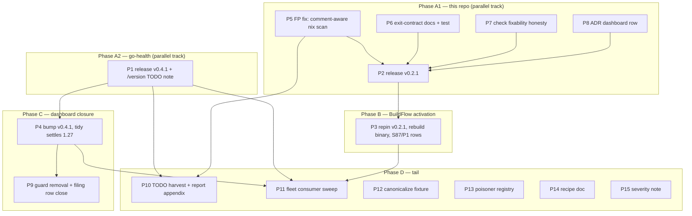

# Plan — Poisoner-Chain Dissolution & Supply-Side Closure

**Date:** 2026-09-25 09:57
**Source:** `docs/status/2026-09-25_05-32_fleet-integration-audit-self-review.md` (session findings) + planning-session research (2026-09-25 09:43–09:57)
**Mode:** FULL EXECUTION authorized (user decision 2026-09-25)

## Locked user decisions

| # | Decision | Choice |
|---|----------|--------|
| 1 | go-health release version | **v0.4.1** (patch; floor-lowering is consumer-compatible) |
| 2 | Bundle flake pin fix into release | **MOOT** — planning research proved the flake finding was OUR false positive (comment matched); go-health's real pin is already `go_1_27`. Nothing to bundle. |
| 3 | `fix` exit code for dep-forced-only runs | **Keep 0 + fix the doc wording** (dep-forced is externally forced, not fix's failure) |
| 4 | `/version` HTTP-endpoint idea | **Route to go-health** (they own health endpoints); note in their TODO/ROADMAP only |
| 5 | Scope after plan commit | **Full execution**, incl. cross-repo release work |

## Planning-session discoveries (changed the plan)

1. **FALSE POSITIVE in our tool (Critical, credibility):** `scanNixPins` (pkg/surface/discover.go:227) matches `go_1_26` inside Nix **comments**. go-health flake.nix:41 is a comment explaining why the pin is `go_1_27` (line 43) — our `check` reported `nix-pin-below-floor flake.nix:41` on a correctly-configured repo. Fix: comment-aware scanning (strip `#` line comments outside strings + `/* */` spans).
2. **BuildFlow's INSTALLED binary pins this tool at v0.1.0** (`/run/current-system/.../buildflow-7e1fbfe` ← flake `ref=refs/tags/v0.1.0` at that commit). The v0.2.0 tidy gate + go-work-aware fixer are NOT active in the binary that runs fleet-wide — the dashboard incident class can recur until rebuild. BuildFlow HEAD's flake already pins v0.2.0.
3. **T2 in our TODO_LIST is stale** (BuildFlow blank-import shipped 2026-09-18 per their gotcha #171).
4. **go-health release surface:** master is `go 1.27`, CHANGELOG Unreleased empty, tree clean → v0.4.1 is a CHANGELOG entry + tag away.

## Pareto breakdown

### The 1% that delivers 51%
1. **go-health v0.4.1 tag + push** — dissolves the entire dashboard conflict chain (finding, CI guard, policy split brain, filing row).
2. **BuildFlow binary rebuild at HEAD (then v0.2.1)** — activates the dep-floor gate + go-work-aware fixer in the binary that actually runs. Without it, every fix here is inert fleet-wide.

### The 4% that delivers 64% (1% +)
3. Dashboard bump to go-health v0.4.1 → tidy settles `go 1.27` → guard script + CI wiring deleted → filing row closed with `who-forces` evidence.

### The 20% that delivers 80% (4% +)
4. False-positive fix (comment-aware nix pin scan) — our tool stops lying about correctly-configured flakes.
5. Exit-contract doc alignment + regression test (decision 3).
6. check fixability honesty: stop promising "all auto-fixable" for gate-dependent fixes; surface the supply-side hint in check output.
7. ADR 0001 consumer baseline gains the dashboard row.
→ shipped together as **v0.2.1** (the FP fix is worthless unreleased: BuildFlow consumes tags).

### The other 20% to reach 100%
8. BuildFlow S87/P1 row reconciliation + defense-retirement evaluation.
9. CanonicalizeGoMod dep-forced fixture (dashboard-shaped).
10. Fleet consumer sweep (all go-health importers) post-re-tag.
11. Poisoner registry doc consolidation (x/text, encoding/json/v2, go-health v0.4.0→v0.4.1).
12. Gate-verification recipe doc (throwaway-copy method).
13. go-health TODO note: `/version` endpoint idea (decision 4).
14. TODO_LIST harvest (new tasks + T2 staleness fix) + status-report correction appendix (the flake FP claim).
15. Severity review documentation (patch-form finding stays warning for dep-forced states).

## Comprehensive plan (30–100 min tasks, sorted by impact)

| ID | Task | Repo | Impact | Effort | Depends on |
|----|------|------|--------|--------|-----------|
| P1 | Release go-health **v0.4.1**: CHANGELOG `Fixed` entry (go directive 1.27.1→1.27, unblocks consumers from patch-form floor), annotated tag, push master+tag, proxy verify `go get @v0.4.1`; fold in TODO note for `/version` endpoint idea | go-health | Critical | 45m | — |
| P2 | Ship **v0.2.1** of this tool: FP fix (P5) + exit doc (P6) + check UX (P7) + ADR row (P8) + CHANGELOG + full gates + tag + push + proxy verify | this repo | Critical | 90m | P5–P8 |
| P3 | BuildFlow repin v0.2.1 + **rebuild + reinstall binary** + verify embedded gvac version + update S87/P1 TODO rows + evaluate retiring GoWorkFloorFinding defenses | BuildFlow | Critical | 60m | P2 |
| P4 | Dashboard consumer bump: `go get go-health@v0.4.1`, tidy settles `go 1.27`, run gates (build/test/lint), commit | dashboard | Critical | 60m | P1 |
| P5 | FP fix: comment-aware `scanNixPins` (strip `#` outside strings, `/* */` spans) + fixtures incl. go-health's exact comment shape | this repo | Critical | 60m | — |
| P6 | Exit-contract alignment: AGENTS.md wording (fix: dep-forced-only = 0, check/who-forces = 1), main.go comment, regression test | this repo | High | 45m | — |
| P7 | check honesty: relabel gate-dependent fixability ("fixable pending dep-floor gate") + append supply-side hint to check output for patch-form findings | this repo | High | 90m | — |
| P8 | ADR 0001 appendix: dashboard consumer row (poisoner go-health v0.4.0 → resolved v0.4.1) | this repo | High | 30m | — |
| P9 | Dashboard guard removal: delete `scripts/check-go-directive.sh` + CI wiring in `ci.yml`, close fleet-filing TODO row with gate-fixed-upstream evidence + `who-forces` output | dashboard | High | 45m | P4 |
| P10 | TODO_LIST harvest: new T13 section, mark T2 done-stale, update T1 open consumer row; correction appendix in the 05-32 status report (flake FP) | this repo | Medium | 30m | — |
| P11 | Fleet consumer sweep: all go-health importers `check`/`fix` post-re-tag; confirm each settles minor-form | fleet | Medium | 60m | P1 |
| P12 | CanonicalizeGoMod dep-forced fixture: verify gate coverage, add dashboard-shaped case | this repo | Medium | 45m | — |
| P13 | Poisoner registry doc: consolidate active poisoner list from AGENTS.md + ADR appendix into one table | this repo | Low | 30m | P8 |
| P14 | Gate-verification recipe doc: throwaway-copy method for testing poisoner consumers safely | this repo | Low | 30m | — |
| P15 | Severity-review note: document that dep-forced patch-form findings stay warning-severity (rules.go comment + DOMAIN_LANGUAGE) | this repo | Low | 30m | P7 |

## Fine breakdown (≤12 min tasks, sorted by impact; ALL TODOs)

### Tier 1 — Critical path

| # | Task (≤12m) | Parent | Est |
|---|-------------|--------|-----|
| 1 | go-health: verify master state (go.mod `go 1.27`, clean tree, no stray replaces) | P1 | 5m |
| 2 | go-health: devShell build + test green precondition | P1 | 10m |
| 3 | go-health: CHANGELOG `[v0.4.1]` Fixed entry (floor 1.27.1→1.27 minor form) | P1 | 8m |
| 4 | go-health: commit CHANGELOG | P1 | 4m |
| 5 | go-health: annotated tag `v0.4.1` (message: floor fix rationale) | P1 | 4m |
| 6 | go-health: push master + tag | P1 | 4m |
| 7 | go-health: proxy verify (`go get github.com/larsartmann/go-health@v0.4.1` in scratch module) | P1 | 10m |
| 8 | go-health: TODO/ROADMAP note — `/version` endpoint idea (health-endpoint feature, not version-surface) | P1 | 8m |
| 9 | this repo: read `scanNixPins` + write comment-stripping helper design (inline `#`, block `/* */`, quote-aware) | P5 | 10m |
| 10 | this repo: implement `stripNixComment(line, state)` w/ block-comment carry | P5 | 12m |
| 11 | this repo: fixture — go-health's exact lines 39–43 (comment go_1_26, real go_1_27) → expect single pin 1.27 | P5 | 10m |
| 12 | this repo: fixture — block comment spanning lines w/ pins; quoted `#` in URLs not treated as comment | P5 | 10m |
| 13 | this repo: fixture — `buildGo126Module` inside comment ignored | P5 | 8m |
| 14 | this repo: run pkg/surface tests + gofmt | P5 | 6m |
| 15 | this repo: live re-run `check` on go-health → expect 0 findings (exit 0) | P5 | 6m |
| 16 | this repo: AGENTS.md exit-contract wording fix (fix=0 on dep-forced-only; 1 = check findings/failed fixes/who-forces poisoned) | P6 | 8m |
| 17 | this repo: main.go line-37 comment fix | P6 | 4m |
| 18 | this repo: regression test — fix on dep-forced-only repo → exit 0, dep-forced counted | P6 | 12m |
| 19 | this repo: check UX — locate renderFixability/summary code path | P7 | 8m |
| 20 | this repo: implement relabel: "auto-fixable (pending dep-floor gate)" when patch-form go.mod finding present | P7 | 12m |
| 21 | this repo: check output appends supply-side hint line for patch-form findings | P7 | 10m |
| 22 | this repo: tests for 20–21 (human + `--json` schema stability check) | P7 | 12m |
| 23 | this repo: ADR appendix dashboard row (markdown table append) | P8 | 10m |
| 24 | this repo: CHANGELOG `## [Unreleased]`→v0.2.1 section (FP fix, check honesty, exit doc) | P2 | 10m |
| 25 | this repo: full gates in devShell: `go build`, `go test ./...`, `go vet`, golangci if configured | P2 | 12m |
| 26 | this repo: dogfood `check --expect-minor 1.27 .` exit 0 | P2 | 6m |
| 27 | this repo: commit v0.2.1 work (detailed message) | P2 | 6m |
| 28 | this repo: tag `v0.2.1` + push master + tag | P2 | 6m |
| 29 | this repo: proxy verify `go get @v0.2.1` | P2 | 8m |

### Tier 2 — Activation & consumer closure

| # | Task (≤12m) | Parent | Est |
|---|-------------|--------|-----|
| 30 | BuildFlow: `nix flake update go-version-auto-configure` (or edit ref→v0.2.1) | P3 | 8m |
| 31 | BuildFlow: bump tools/go.mod require + `go work vendor` + vendorHash refresh | P3 | 12m |
| 32 | BuildFlow: `nix build .` (FOD, may take long — background) | P3 | 12m+ |
| 33 | BuildFlow: reinstall binary to profile; verify `buildflow` resolves to new store path | P3 | 8m |
| 34 | BuildFlow: verify embedded gvac version (single-step dry run or version stamp) | P3 | 8m |
| 35 | BuildFlow: S87 row update (upstream fix shipped v0.2.0/v0.2.1; defenses = safety net; retire decision) | P3 | 10m |
| 36 | BuildFlow: P1 row update (release chain done) | P3 | 6m |
| 37 | dashboard: `go get go-health@v0.4.1` + `go mod tidy` (expect settle `go 1.27`) | P4 | 10m |
| 38 | dashboard: verify go.mod `go 1.27`, no toolchain line, go.sum consistent | P4 | 5m |
| 39 | dashboard: gates — build + test (+ templ regenerate first per their rules) | P4 | 12m |
| 40 | dashboard: commit bump (detailed message) + push | P4 | 8m |
| 41 | dashboard: `gvac check` → expect 0 findings, exit 0 (first time clean) | P4 | 6m |
| 42 | dashboard: delete `scripts/check-go-directive.sh` | P9 | 4m |
| 43 | dashboard: remove CI wiring (ci.yml steps + comments) | P9 | 10m |
| 44 | dashboard: `gvac who-forces` output → paste into TODO fleet-filing row; close as fixed-upstream (gate v0.2.0+) | P9 | 10m |
| 45 | dashboard: AGENTS.md gotcha update (guard obsolete; note resolution) | P9 | 10m |
| 46 | dashboard: commit + push guard removal | P9 | 6m |

### Tier 3 — Hardening, docs, closure (the other 20%)

| # | Task (≤12m) | Parent | Est |
|---|-------------|--------|-----|
| 47 | this repo: TODO_LIST — add T13 (this plan's durable items) | P10 | 10m |
| 48 | this repo: TODO_LIST — mark T2 done-stale (BuildFlow wiring shipped 09-18) | P10 | 5m |
| 49 | this repo: TODO_LIST — T1 consumer-row update (dashboard resolved via go-health v0.4.1) | P10 | 5m |
| 50 | status report 05-32: append correction appendix (flake finding = our FP; resolved by P5) | P10 | 8m |
| 51 | this repo: verify CanonicalizeGoMod gate test coverage (grep dep-floor tests) | P12 | 8m |
| 52 | this repo: add dashboard-shaped canonicalize fixture if 51 finds a gap | P12 | 12m |
| 53 | fleet: enumerate go-health importers (grep go.mod across ~/projects) | P11 | 10m |
| 54 | fleet: run `check` on each importer; record drift matrix | P11 | 12m |
| 55 | fleet: `fix` where mechanical; verify tidy stability | P11 | 12m |
| 56 | this repo: poisoner registry doc `docs/POISONERS.md` (table: module, floor, status) | P13 | 12m |
| 57 | this repo: link registry from AGENTS.md floor-poisoning section | P13 | 5m |
| 58 | this repo: recipe doc — throwaway-copy gate verification (cp --exclude .git, fix, assert untouched, trash) | P14 | 12m |
| 59 | this repo: severity-review note in rules.go + DOMAIN_LANGUAGE (dep-forced = warning, not error) | P15 | 10m |
| 60 | this repo: final full gate run + commit remaining docs | P15 | 10m |

## Execution graph

**Total:** 15 comprehensive tasks (P1–P15), 60 micro-tasks, est. ~11h serial (much parallelizable). Critical path: P5→P2→P3 and P1→P4→P9.

## Anti-verschlimmbesserung guardrails

- No exit-code BEHAVIOR changes (decision 3: docs only) — BuildFlow gate semantics untouched.
- FP fix must not over-strip: quoted `#` in URLs stays scannable; only true comments dropped; fixtures pin both directions.
- No retraction/re-litigation of any published tag; new tags only (v0.4.1, v0.2.1).
- Dashboard edits stay within their documented invariants (regenerate templ before gates; never run Go tooling during active buildflow runs — check `pgrep -fa buildflow` first).
- Every phase commits with a detailed message; no force-pushes; tags annotated.
