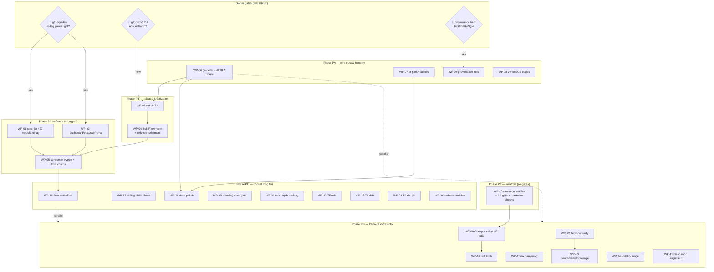

# Execution Plan — Fleet Convergence & Tool Truth (Pareto)

**Created:** 2026-10-03 00:56 CEST · **Repo:** `github.com/larsartmann/go-version-auto-configure` (master @ `2871bcf`, clean)
**Input:** `TODO_LIST.md` (rebuilt by the 2026-10-03 docs-health audit: T1/T3/T5/T6/T9/T12/T14/T15/T16/T17), `ROADMAP.md` (themes + 8 open questions), `docs/status/2026-10-03_00-53_docs-health-full-audit-rebuild-annotate-archive.md` (§f, 40 items).
**Scope:** every open TODO in this repo, including the cross-repo work this repo drives (re-tag campaigns, BuildFlow repin, fleet sweeps). Owner-gated items are planned but not executable without the named decision — the plan never assumes a green light.

**Format note:** Markdown + mermaid per explicit user instruction — overrides the pareto-planning skill's styled-HTML default (same override pattern as every plan in this repo).

---

## 0. Situation (why this plan, in 5 lines)

1. The tool is healthy and shipped (v0.2.3, pkg.go.dev live, CI green, dogfood clean) — the remaining work is (a) the fleet campaign it exists for and (b) hardening the trust surface the fleet consumes.
2. **7 of 12 known importers stay dep-forced** until the pending poisoners re-tag: go-cqrs-lite v4 family (~27 modules, the 51% lever), go-health-dashboard v0.10.x, go-etag, go-sse, cqrs-htmx.
3. The go-output v0.38.2 incident (2026-10-02) exposed two trust gaps: `who-forces` cannot answer "who holds me at parity" (at-parity carriers), and "release X is clean" claims are recorded without published-artifact evidence (10-day inversion).
4. v0.2.3's `depForced.cause` field and the vendor fallback are unit-tested but NOT golden-locked in cmd/ — the wire contract BuildFlow consumes can drift silently.
5. The 2026-09-30 re-poisoning class (dep sweep silently lifting the directive) is caught only after the fact — CI has no tidy-diff gate.

## 1. Pareto Breakdown

### The 1% that delivers 51% — ONE campaign

**WP-01: Coordinated go-cqrs-lite v4 family re-tag (~27 modules).** The largest pending poisoner set; unblocks the most consumers (dnsblockd, DiscordSync, cqrs-htmx importers, plus everything downstream of the metaengine family). Everything else in the convergence half queues behind it. **Owner-gated** (irreversible proxy writes; question g1 since 2026-09-26).

### The 4% that deliver 64% — campaign + activation + wire trust

1% + **WP-04** (BuildFlow repin to a green v0.2.x tag + defense retirement — activates the v0.2.3 gate and go-work-aware fixer in the binary that actually runs fleet-wide) + **WP-06** (golden-lock the dep-forced wire incl. `cause` + clean-state snapshot + the v0.38.2 regression fixture — the machine contract stops being trust-me).

### The 20% that deliver 80% — + the rest of the campaign + the honesty gaps

4% + **WP-02** (dashboard v0.10.x + go-etag + go-sse re-tags + cqrs-htmx surface mapping) + **WP-05** (consumer sweep with ADR count refresh — convergence becomes measurable, incl. go-output v0.38.3 bumps which need NO gate) + **WP-07** (`who-forces` at-parity carriers — the exact question the incident session had to answer with raw `go list -m`) + **WP-09** (CI depth incl. the tidy-diff gate that would have caught 2026-09-30 before it shipped) + **WP-16** (POISONERS evidence convention + ADR incident records — the rule that prevents the next 10-day inversion).

### The remaining 20% → 100% (do not forget the long tail)

**WP-03** (v0.2.4 cut, gated), **WP-08** (provenance field, policy-gated), **WP-10..WP-15** (test truth: e2e tidy gate, invariants; nix hardening: go-nix-helpers bump, FOD check; refactors: depFloor unify; measurement: benchmarks/coverage; stability: license-check isolation, doctor/vulnix, art-dupl; BuildFlow disposition alignment), **WP-17..WP-21** (sibling claim check; vendor-stanza/UX; docs polish incl. README example; standing docs gate; test-depth backlog), **WP-22..WP-24** (T5/T6/T9 — the three designed-but-unbuilt features), **WP-25** (audit tail: canonical verifies, full gate, upstream close-the-loop), **WP-26** (website decision — demand-gated).

---

## 2. Comprehensive Plan — Work Packages (30–100 min each)

Sorted by importance/impact/effort/customer-value. 🚩 = owner-gated (do not start without the named decision). "Covers" = TODO_LIST rows.

| WP | Work package                                                                                                                                                                                                                                                                                                                                       | Covers                   | Impact   | Effort               | Customer value                                                        |
| -- | -------------------------------------------------------------------------------------------------------------------------------------------------------------------------------------------------------------------------------------------------------------------------------------------------------------------------------------------------- | ------------------------ | -------- | -------------------- | --------------------------------------------------------------------- |
| 01 | 🚩 **go-cqrs-lite v4 coordinated re-tag campaign** (~27 modules): inventory → per-module floor plan (minor form, x/text exception) → strip via `go mod edit` → build+test per family → replace-leak check → CHANGELOG → annotated tags (count-asserted, never `2>/dev/null`) → push → per-tag proxy `.mod` verification → POISONERS row → Resolved | T14-① (core)             | Critical | L (multi-session ok) | The single largest poisoner dies; 7+ consumers unblock                |
| 02 | 🚩 **Remaining re-tags:** go-health-dashboard v0.10.x (master already fixed — tag + verify), go-etag + go-sse (strip/test/tag/verify), cqrs-htmx surface mapping via `who-forces` across importers BEFORE its re-tag                                                                                                                               | T14-① (rest)             | Critical | M                    | Every named PENDING poisoner in POISONERS.md resolved or mapped       |
| 03 | 🚩 **Cut v0.2.4**: fold `[Unreleased]` (go-output v0.38.3 bump) + any shipped WP-06/07 goldens into the release section; full gates in devShell; tag+push; proxy `go get @v0.2.4` + pkg.go.dev check                                                                                                                                               | CHANGELOG Unreleased; g2 | High     | S                    | Fleet repins and `@latest` consumers get the clean graph              |
| 04 | **BuildFlow repin + defense retirement:** flake ref → v0.2.3 (or v0.2.4 if WP-03 shipped first — repin ONCE), tools/go.mod + `go work vendor` + vendorHash, nix build + reinstall + version verify, S87 `GoWorkFloorFinding`/`RestoreGoWorkFloor` retirement decision + row updates, live step run                                                 | T14-②                    | Critical | M                    | The running binary gains the v0.2.3 gate + vendor fallback fleet-wide |
| 05 | **Fleet consumer sweep + ADR refresh:** baseline `check --quiet --expect-minor 1.27 ~/projects/*/`; enumerate go-output v0.38.2 pinners (no gate — supply side is fixed) and bump them; post-WP-01/02 re-sweep expecting dep-forced → clean transitions; per-outcome `git status` spot-checks; update ADR-0001 appendix counts                     | T1-①, T1-② (partial)     | Critical | L                    | Convergence becomes a measured number, not a vibe                     |
| 06 | **Wire-trust goldens:** offline-safe dep-forced fixture (replace-to-local poisoner); `fix --json` golden incl. `cause`; clean-state `--json` snapshot (schema 2); synthetic consumer pinning go-output v0.38.2 asserting dep-forced + carrier naming (validates v0.2.3 against the real incident)                                                  | T15-②③                   | Critical | M                    | The contract BuildFlow consumes can no longer drift silently          |
| 07 | **`who-forces` at-parity carriers:** when directive == max dep floor, list the carriers instead of answering "clean" (the 2026-10-02 session's core unanswered question); tests; output shape reviewed against `poisonerFloors`                                                                                                                    | T15-①                    | High     | M                    | The tool answers its most-asked question in one command               |
| 08 | 🚩 **Provenance `source: "vendor"\|"list"`** additive field (schema stays 2) — gated on the ROADMAP open question; implement + tests + docs once answered                                                                                                                                                                                          | T15-④; ROADMAP Q         | Medium   | S                    | Silent vendor fallback becomes visible to machines                    |
| 09 | **CI depth:** pin golangci-lint to the devShell version; erraudit step; concurrency group; **`go mod tidy -diff` gate** (the 2026-09-30 class dies pre-push); README floor-line dogfood check (README ≥ go.mod minor); `version`-stamp assertion                                                                                                   | T16-①②                   | High     | M                    | The next sweep cannot re-poison master silently                       |
| 10 | **Test truth:** e2e seeded fixture running the REAL `go mod tidy -diff` gate (today always faked); extend `ParseDirective`-shared-verification invariants for the post-v0.38.3 state; deliberate `buildflow update` re-run proving the sweep settles at `go 1.27`                                                                                  | T16-③④⑤                  | High     | M                    | Claims about gates stop resting on fakes                              |
| 11 | **Nix hardening:** bump go-nix-helpers pin (auto-newest `goPkgAttr` + eval-time floor check makes the FOD class impossible); `nix build` green; add `checks` entry asserting FOD go ≥ go.mod floor                                                                                                                                                 | T16-⑥⑦                   | Medium   | M                    | The chronic nix-red class is prevented, not documented                |
| 12 | **depFloor unification:** extract the shared dependency-floor triple (`vendorModuleFloor` generalized) across who.go and floor.go; kill the last floor-parser split brain; behavior-identical (goldens prove it)                                                                                                                                   | T16-⑧                    | Medium   | M                    | One model, four parsers → one                                         |
| 13 | **Measurement:** re-run benchmark suite (`-benchmem`) vs the T11 baseline after the v0.2.3 hot-path refactor; re-measure per-package coverage against the 80% bar; **record both in a living doc** (baselines must not be archive-only)                                                                                                            | T16-⑨ + audit e6         | Medium   | S                    | Performance/coverage claims become current facts                      |
| 14 | **Stability triage:** license-check isolation (N isolated runs, diff cache/network/package-set); review the 9 doctor "tools unavailable" warnings; vulnix gcc CVE-2023-4039 triage; art-dupl 56 vs DEDUPLICATION baseline diff                                                                                                                     | T16-⑩⑪⑫                  | Medium   | M                    | Warning noise stops rotting                                           |
| 15 | **gomod-check ↔ go-mod-normalize alignment:** reproduce the 20×-go-line-flip warning; read BuildFlow's dispositions; align (their repo or local skip posture); record the decision next to the .buildflow.yml guard                                                                                                                                | T16-⑬                    | Medium   | M                    | Two BuildFlow steps stop fighting over one directive                  |
| 16 | **Fleet-truth docs:** POISONERS evidence convention (proxy `.mod` URL + date per row) + "no re-tag ships without published-`.mod` verification" maintenance rule; ADR-0001 appendix records (2026-09-26 classification session + the v0.38.2 regression incident); DOMAIN_LANGUAGE entries for MVS floor propagation + pin-in-tag                  | T17-①②③                  | High     | S                    | The 10-day-inversion class becomes structurally harder                |
| 17 | **Sibling inverted-claim check:** grep sibling autoconfigurer repos for copies of the "v0.38.2 is minor-form" claim; fix hits; record verification date                                                                                                                                                                                            | T17-④                    | Medium   | S                    | Fleet docs stop carrying the falsified premise                        |
| 18 | **Vendor/UX edges:** vendor-fallback indirect-stanza support OR `--help` limitation note; better error when `GOTOOLCHAIN=auto` needs a download in offline CI                                                                                                                                                                                      | T15-⑤⑥                   | Medium   | M                    | The two known honesty gaps in who-forces close                        |
| 19 | **Docs polish:** README `who-forces` example from a real poisoned-fixture run (feeds off WP-06's fixture); README auto-fix paragraph gains the CanonicalizeGoMod text-surgery nuance; FEATURES evidence-anchor re-walk; re-open ADR-0001 and verify cited rows                                                                                     | T15-⑦ + audit b2/b3, e7  | Medium   | S                    | The sales page and the inventory both tell the whole truth            |
| 20 | **Standing docs gate:** script (flake app or BuildFlow step) — lychee link check + "no `[x]` in TODO_LIST" grep + stale-report harvest probe; wire it; document in AGENTS                                                                                                                                                                          | T16-⑭                    | Medium   | S                    | Half of every docs-health audit becomes mechanical                    |
| 21 | **Test-depth backlog (batch):** flag-help property/snapshot test; `exitFrom*` outcome-combination table; `runSorted` zero-items + parallel equivalence; `version` output golden through cmdguard; `BenchmarkApplyAll`                                                                                                                              | T16-⑮                    | Low      | M                    | Cheap insurance, batched                                              |
| 22 | **T5 gomod-checker "tidy revert" rule:** finalize spec against gomod-checker's API; fixtures (a) x/text-forced `1.26.0` silent, (b) json/v2 std floor silent, (c) `1.26.7` vs max-dep `1.26` FIRES; implement in BuildFlow reusing `CompareDirective` semantics                                                                                    | T5                       | Medium   | L                    | Repos that never run this tool still get the poisoning signature      |
| 23 | **T6 release-authority drift:** pure first pass in `Discover` (VERSION file vs CHANGELOG top → `release-authority-drift`, suggest-only); design the optional git-tag second pass                                                                                                                                                                   | T6                       | Medium   | M                    | A new drift class gets an owner                                       |
| 24 | **T9 `nix-pin` command:** decide the home (CLI command vs BuildFlow step — recommendation: BuildFlow step, impurity belongs there); implement `nix eval` effective-Go check (cached by rev, `--json` with `source: "nix-pin"`); tests with a fake `nix eval`                                                                                       | T9                       | Low      | L                    | The last unparsed pin source, at the right purity boundary            |
| 25 | **Audit tail + upstream close-the-loop:** canonical dependabot verify (`nix develop -c buildflow -s dependabot-auto-configure`); first-hand `go mod tidy -diff`; full BuildFlow gate inside the devShell; check branching-flow#1 / dependabot-auto-configure#3 / go-cqrs-lite#42 statuses and un-skip when closed; forbidigo recurrence watch      | T12 + audit b1/b4, e8    | Medium   | S                    | The audit's own partials close; standing notes stay true              |
| 26 | **Website decision** (demand-gated): revisit only on a real demand signal; if triggered, sibling-project pattern + demo video per the website-launch skill                                                                                                                                                                                         | T3                       | Low      | —                    | Explicit non-commitment, recorded                                     |

**Sum: 26 work packages.** Critical path: WP-01 → WP-05 → (ADR counts) and WP-06 → WP-03 → WP-04. Parallelizable: WP-07..WP-21 have no cross-dependencies beyond noted feeds.

---

## 3. Fine Breakdown — Micro-Tasks (each ≤12 min)

Same sort order. Impact inherited from the parent WP. ⏱ = the few that run long in wall-clock (builds/waits) but ≤12 min of operator time.

### Phase P0 — verify the audit tail (WP-25)

| # | Micro-task                                                                                                                 | WP | ≤min |
| - | -------------------------------------------------------------------------------------------------------------------------- | -- | ---- |
| 1 | Canonical dependabot verify: `nix develop -c buildflow -s dependabot-auto-configure` (expect: actions-entry findings gone) | 25 | 8    |
| 2 | First-hand `go mod tidy -diff` on master (expect empty; closes audit b4)                                                   | 25 | 5    |
| 3 | Full BuildFlow gate inside devShell (`nix develop -c buildflow` — lychee incl. rebuilt docs) ⏱                             | 25 | 12   |
| 4 | Check statuses: branching-flow#1, dependabot-auto-configure#3, go-cqrs-lite#42 (un-skip any that closed)                   | 25 | 10   |
| 5 | forbidigo recurrence: grep latest findings output; note watch state in TODO_LIST T12 if changed                            | 25 | 5    |

### Phase PA — wire trust & honesty (WP-06, 07, 08, 18)

| #  | Micro-task                                                                                                        | WP | ≤min |
| -- | ----------------------------------------------------------------------------------------------------------------- | -- | ---- |
| 6  | Build offline-safe dep-forced fixture: temp module + replace-to-local poisoner at `go 1.27.1`                     | 06 | 12   |
| 7  | Run `fix --json` on fixture; capture actual wire output (record-then-assert)                                      | 06 | 8    |
| 8  | Write `fix --json` golden incl. `depForced[].cause`; wire into cmd goldens                                        | 06 | 12   |
| 9  | Clean-state `--json` snapshot test for all three commands (schema 2, current repo shape)                          | 06 | 10   |
| 10 | Synthetic go-output@v0.38.2 consumer fixture (fake module floor `1.27.1`)                                         | 06 | 10   |
| 11 | Assert: dep-forced classification + carrier named + exit 0 (the incident's exact shape)                           | 06 | 10   |
| 12 | Design at-parity output: carriers listed when directive == max floor (reuse poisonerFloors shape)                 | 07 | 10   |
| 13 | Implement in `AnalyzeFloors`; keep `poisoned` semantics unchanged                                                 | 07 | 12   |
| 14 | Tests: at-parity lists carriers; below-parity unchanged; go.work row unchanged                                    | 07 | 12   |
| 15 | 🚩 Ask owner the provenance question (ROADMAP) if unanswered; record decision                                     | 08 | 5    |
| 16 | Implement additive `source` field (`vendor`\|`list`) + struct tags (schema stays 2)                               | 08 | 10   |
| 17 | Provenance tests: vendor-fallback row carries `source: "vendor"`; list row `"list"`                               | 08 | 10   |
| 18 | Document `source` in README JSON table (additive, `omitempty`)                                                    | 08 | 5    |
| 19 | Vendor stanzas: extend parser to non-explicit stanzas OR add `--help` limitation note (decide by fixture reality) | 18 | 12   |
| 20 | Offline toolchain download: wrap the raw go error with an actionable message + hint                               | 18 | 12   |
| 21 | Tests for 19–20 (fixture with poisoned vendor tree; fake runner error)                                            | 18 | 12   |

### Phase PB — release & activation (WP-03, 04)

| #  | Micro-task                                                                                                      | WP | ≤min |
| -- | --------------------------------------------------------------------------------------------------------------- | -- | ---- |
| 22 | 🚩 Owner decision g2: cut v0.2.4 now (dep bump + goldens) or batch with T15                                     | 03 | 5    |
| 23 | CHANGELOG: move Unreleased → `[0.2.4]` + any WP-06/07 additions                                                 | 03 | 10   |
| 24 | Full release gates in devShell: build, test -race, lint, dogfood (`check --expect-minor 1.27 .`) ⏱              | 03 | 12   |
| 25 | Tag `v0.2.4` + push master + tag (workflow registered — no same-push race)                                      | 03 | 8    |
| 26 | Proxy verify `go get @v0.2.4` in scratch module + proxy `.mod` check (evidence rule)                            | 03 | 10   |
| 27 | BuildFlow: flake input ref → v0.2.3/v0.2.4 (ONE repin; pick the shipped tag)                                    | 04 | 8    |
| 28 | BuildFlow: tools/go.mod bump + `go work vendor` + vendorHash refresh                                            | 04 | 12   |
| 29 | BuildFlow: `nix build .` + reinstall to profile + `buildflow version` verify ⏱                                  | 04 | 12   |
| 30 | BuildFlow: live `-s go-version-auto-configure` run on a drifted fixture (gate active proof)                     | 04 | 8    |
| 31 | BuildFlow: S87 defense retirement decision (`GoWorkFloorFinding`/`RestoreGoWorkFloor` + DependsOn) + row update | 04 | 10   |
| 32 | BuildFlow: P1 row update (release chain current)                                                                | 04 | 5    |

### Phase PC — fleet campaign (WP-01, 02, 05) 🚩 gated

| #  | Micro-task                                                                                       | WP | ≤min |
| -- | ------------------------------------------------------------------------------------------------ | -- | ---- |
| 33 | 🚩 Owner green light g1 + sequencing (coordinated day vs repo-by-repo) — plan executes on YES    | 01 | 5    |
| 34 | Baseline: inventory all ~27 cqrs-lite modules (tags, directives, x/text exceptions) into a table | 01 | 12   |
| 35 | Per-module floor plan: target minor form; flag x/text-forced `1.26.0` keeps                      | 01 | 12   |
| 36 | Strip directives via `go mod edit -go=` per module (never sed)                                   | 01 | 12   |
| 37 | Build + test module group A (core/claiming/dedup)                                                | 01 | 12 ⏱ |
| 38 | Build + test module group B (metaengine/storage engines)                                         | 01 | 12 ⏱ |
| 39 | Build + test module group C (remaining modules + examples)                                       | 01 | 12 ⏱ |
| 40 | Replace-leak check across all go.mods (go-release Phase 3)                                       | 01 | 8    |
| 41 | CHANGELOG entries (root or per-module per their convention)                                      | 01 | 12   |
| 42 | Annotated tags batch + `git tag -l \| wc -l` count assertion (no swallowed stderr)               | 01 | 12   |
| 43 | Push master + tags; wait for their CI green                                                      | 01 | 10 ⏱ |
| 44 | Per-tag proxy `.mod` verification (root + spot set; record URLs+dates)                           | 01 | 12   |
| 45 | POISONERS.md: cqrs-lite row Active → Resolved with tag pair + evidence                           | 01 | 8    |
| 46 | Dashboard: verify master minor-form + clean tree; cut v0.10.x tag; proxy verify                  | 02 | 12   |
| 47 | go-etag: strip + build/test + tag + proxy verify                                                 | 02 | 12   |
| 48 | go-sse: strip + build/test + tag + proxy verify                                                  | 02 | 12   |
| 49 | cqrs-htmx: `who-forces` across its importers (surface map before re-tag)                         | 02 | 12   |
| 50 | cqrs-htmx: strip + build/test + tag + proxy verify (if map confirms)                             | 02 | 12   |
| 51 | POISONERS.md: remaining rows → Resolved                                                          | 02 | 6    |
| 52 | Sweep baseline: `check --quiet --expect-minor 1.27 ~/projects/*/` snapshot                       | 05 | 10   |
| 53 | Enumerate go-output v0.38.2 pinners (grep go.mod across ~/projects) — NO gate needed             | 05 | 8    |
| 54 | Bump go-output consumers: `go get ...@v0.38.3` + tidy + gvac fix, per repo                       | 05 | 12 ⏱ |
| 55 | Post-re-tag re-sweep: expect dep-forced → clean transitions; record deltas                       | 05 | 10   |
| 56 | Sweep hygiene: one `git status` spot-check per outcome class (applied/dep-forced/failed)         | 05 | 8    |
| 57 | ADR-0001 appendix: update consumer-baseline counts + flagship rows                               | 05 | 10   |

### Phase PD — CI, nix, tests, refactor (WP-09, 10, 11, 12, 13, 14, 15)

| #  | Micro-task                                                                         | WP | ≤min |
| -- | ---------------------------------------------------------------------------------- | -- | ---- |
| 58 | ci.yml: pin golangci-lint to the devShell's version                                | 09 | 8    |
| 59 | ci.yml: erraudit step (`--type-aware`, fallback documented)                        | 09 | 10   |
| 60 | ci.yml: concurrency group (cancel superseded runs)                                 | 09 | 5    |
| 61 | ci.yml: `go mod tidy -diff` gate job (the 2026-09-30 class dies here)              | 09 | 12   |
| 62 | README floor-line dogfood check (assert README ≥ go.mod minor; script or grep job) | 09 | 12   |
| 63 | `version`-stamp assertion in CI (catch stale binaries)                             | 09 | 8    |
| 64 | Verify workflow green end-to-end on push                                           | 09 | 10 ⏱ |
| 65 | e2e test: seeded fixture repo through the REAL `go mod tidy -diff` gate            | 10 | 12   |
| 66 | Extend ParseDirective invariant tests for the post-v0.38.3 state                   | 10 | 10   |
| 67 | Deliberate `buildflow update` re-run; assert settles at `go 1.27`; record          | 10 | 12 ⏱ |
| 68 | go-nix-helpers: bump input + refresh vendorHash                                    | 11 | 12   |
| 69 | `nix build .#go-version-auto-configure` green after bump ⏱                         | 11 | 12   |
| 70 | flake `checks` entry: assert FOD go version ≥ go.mod floor                         | 11 | 12   |
| 71 | depFloor: extract shared triple model from `vendorModuleFloor`                     | 12 | 12   |
| 72 | Migrate who.go parsers onto depFloor                                               | 12 | 12   |
| 73 | Migrate floor.go parsers onto depFloor                                             | 12 | 12   |
| 74 | Full suite + goldens green (behavior-identical proof)                              | 12 | 8    |
| 75 | Benchmarks: re-run suite with `-benchmem`                                          | 13 | 12 ⏱ |
| 76 | Compare vs T11 baseline; write deltas into a LIVING doc (AGENTS or docs/)          | 13 | 10   |
| 77 | Coverage: `go test -cover` per package; update FEATURES/TODO numbers               | 13 | 10   |
| 78 | license-check: 5 isolated runs; diff inputs (cache/network/package-set)            | 14 | 12   |
| 79 | license-check: disposition (root-cause note, reasoned skip, or fix)                | 14 | 10   |
| 80 | Doctor: review the 9 "tools unavailable" warnings; install/document                | 14 | 10   |
| 81 | vulnix: triage gcc-10.4.0 CVE-2023-4039 (warning-severity)                         | 14 | 8    |
| 82 | art-dupl: run + diff 56 findings vs DEDUPLICATION baseline; record verdict         | 14 | 12   |
| 83 | Reproduce the gomod-check ↔ go-mod-normalize flipflop warning (20× go line)        | 15 | 10   |
| 84 | Read BuildFlow's two dispositions; identify the conflicting rule pair              | 15 | 12   |
| 85 | Align: fix disposition (their repo) or adjust local skip posture                   | 15 | 12   |
| 86 | Record the decision next to the .buildflow.yml guard comment                       | 15 | 5    |

### Phase PE — docs & long tail (WP-16, 17, 19, 20, 21, 22, 23, 24, 26)

| #   | Micro-task                                                                                       | WP | ≤min |
| --- | ------------------------------------------------------------------------------------------------ | -- | ---- |
| 87  | POISONERS.md: add evidence convention (proxy `.mod` URL + date per row) to Active + Resolved     | 16 | 10   |
| 88  | POISONERS.md: add the maintenance rule ("no re-tag ships without published-`.mod` verification") | 16 | 5    |
| 89  | ADR-0001 appendix: 2026-09-26 classification-fix session record                                  | 16 | 10   |
| 90  | ADR-0001 appendix: go-output v0.38.2 regression incident (2026-09-30 → 10-02)                    | 16 | 12   |
| 91  | DOMAIN_LANGUAGE: MVS floor propagation + pin-in-tag entries                                      | 16 | 10   |
| 92  | Siblings: grep for "v0.38.2 is minor-form"/"v0.38.2+ is minor-form" claims                       | 17 | 8    |
| 93  | Siblings: fix any hits + record verification date                                                | 17 | 10   |
| 94  | README: run `who-forces` on the WP-06 poisoned fixture; capture real output block                | 19 | 10   |
| 95  | README: insert who-forces example next to the dep-forced example                                 | 19 | 8    |
| 96  | README: qualify auto-fix paragraph with the CanonicalizeGoMod text-surgery exception             | 19 | 8    |
| 97  | FEATURES: re-walk every Evidence anchor (open each cited file/test)                              | 19 | 12   |
| 98  | Re-open ADR-0001; verify rows cited by T17/TODO resolve                                          | 19 | 8    |
| 99  | Docs-gate script: lychee + no-`[x]`-in-TODO_LIST + stale-report probe                            | 20 | 12   |
| 100 | Wire as flake app or BuildFlow step; run once green                                              | 20 | 12   |
| 101 | Document the gate in AGENTS (what it checks, how to run)                                         | 20 | 5    |
| 102 | Test depth: flag-help property/snapshot test                                                     | 21 | 12   |
| 103 | Test depth: `exitFrom*` outcome-combination table test                                           | 21 | 12   |
| 104 | Test depth: `runSorted` zero-items + `--parallel 1`/`100` equivalence                            | 21 | 10   |
| 105 | Test depth: `version` output golden through cmdguard                                             | 21 | 8    |
| 106 | Test depth: `BenchmarkApplyAll` with temp git repo                                               | 21 | 12   |
| 107 | T5: finalize rule spec against gomod-checker's API surface                                       | 22 | 12   |
| 108 | T5: fixtures a/b/c (x/text silent, json/v2 silent, 1.26.7 FIRES)                                 | 22 | 12   |
| 109 | T5: implement rule in BuildFlow (reuse `CompareDirective` semantics)                             | 22 | 12   |
| 110 | T5: cross-check rule vs gvac `check` on the same fixtures                                        | 22 | 10   |
| 111 | T6: pure Discover pass (VERSION vs CHANGELOG top) + `release-authority-drift` rule               | 23 | 12   |
| 112 | T6: tests + suggest-only verification (never auto-fix)                                           | 23 | 10   |
| 113 | T6: design note for the optional git-tag second pass                                             | 23 | 8    |
| 114 | T9: home decision (recommendation: BuildFlow step — impurity lives there); record                | 24 | 8    |
| 115 | T9: implement `nix-pin` (impure `nix eval`, cached by rev, `source: "nix-pin"` JSON)             | 24 | 12   |
| 116 | T9: tests with a fake `nix eval` runner                                                          | 24 | 12   |
| 117 | Website: decision row only (demand-gated; revisit on signal)                                     | 26 | 2    |

**Sum: 117 micro-tasks** (the 50-slot budget is not padded — every task traces to a WP; WPs trace to TODO_LIST/ROADMAP).

---

## 4. Execution Graph

**Critical path:** G1 → WP-01 → WP-05 → WP-16 (fleet convergence + its record). **Fast path (no gates needed):** P0 → WP-06 → WP-07 → WP-09 → WP-16 — all pure this-repo value, startable immediately.

## 5. Anti-verschlimmbesserung guardrails

1. **No tag is pushed without the named owner gate** (WP-01/02/03) — proxy writes are irreversible; the plan idles those WPs until YES.
2. **Verify published artifacts, not intentions** — every "release X is clean" step ends with a proxy `.mod` fetch + date recorded (the 2026-10-02 lesson, now executable).
3. **Wire contract stays schema 2; additive only** (`cause` precedent). Goldens record-then-assert — never write expectations from memory.
4. **No exit-code or gate-semantics changes** ride along; behavior-identical refactors (WP-12) prove themselves through the goldens from WP-06.
5. **Strip directives only via `go mod edit` / `go work edit`** — never sed; replace-leak check before every tag batch; tag counts asserted, stderr never swallowed.
6. **Cross-repo work follows the other repo's documented runbook** (BuildFlow P1 ordering, dashboard templ rules); never edit foreign repos mid-their-active-session — check for parallel work first.
7. **Baselines land in living docs, never only in archives** (WP-13); completed TODO rows are deleted to CHANGELOG, never annotated in TODO_LIST.
8. **Plans are snapshots** — when this plan goes stale, docs-health ANNOTATE (never rewrite); new tasks discovered during execution go to TODO_LIST.md.

## 6. Coverage proof (every open TODO → WP)

| TODO_LIST row                                                 | WP                             |
| ------------------------------------------------------------- | ------------------------------ |
| T14-① re-tags (cqrs-lite, dashboard, etag, sse, htmx mapping) | 01, 02                         |
| T14-② BuildFlow retirement + repin                            | 04                             |
| T1-① consumer sweep + ADR counts                              | 05                             |
| T1-② POISONERS Active re-verification                         | 05 (steps 52–56)               |
| T15-① at-parity carriers                                      | 07                             |
| T15-②③ goldens + fixture                                      | 06                             |
| T15-④ provenance                                              | 08 (gated)                     |
| T15-⑤⑥ vendor stanzas + offline error                         | 18                             |
| T15-⑦ README example                                          | 19 (steps 94–95)               |
| T16-①② CI depth + dogfood adds                                | 09                             |
| T16-③④⑤ e2e/invariants/update re-run                          | 10                             |
| T16-⑥⑦ nix helpers + FOD check                                | 11                             |
| T16-⑧ depFloor unify                                          | 12                             |
| T16-⑨ benchmarks + coverage                                   | 13                             |
| T16-⑩⑪⑫ license/doctor/vulnix/art-dupl                        | 14                             |
| T16-⑬ disposition alignment                                   | 15                             |
| T16-⑭ standing docs gate                                      | 20                             |
| T16-⑮ test-depth backlog                                      | 21                             |
| T17-①②③④ fleet docs + sibling check                           | 16, 17                         |
| T5 / T6 / T9                                                  | 22 / 23 / 24                   |
| T12 upstream close-the-loop + watch                           | 25 (steps 4–5)                 |
| T3 website                                                    | 26                             |
| Audit §f 1–7 (session follow-ups)                             | 25, 19, 13                     |
| ROADMAP open questions                                        | gates G1–G3 + parked (not WPs) |

No open TODO is uncovered; no WP exists without a TODO/report source.

---

_Point-in-time snapshot 2026-10-03 00:56 CEST. TODO_LIST.md is the living source; execution begins at Phase P0 (gate-free) and the owner gates G1–G3._
